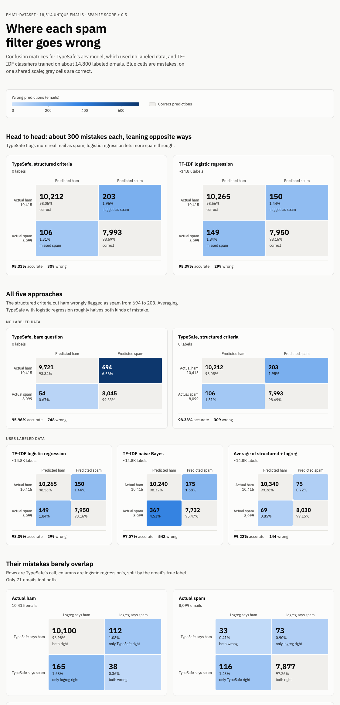

# Spam or ham with TypeSafe Noul questions

An experiment: how close can [TypeSafe](https://typesafe.ai)'s Jev model get to a trained spam
filter with no training data at all? It runs Jev as a zero-shot spam filter on
[realprogrammersusevim/email-dataset](https://github.com/realprogrammersusevim/email-dataset)
(19,528 emails) and compares it with TF-IDF classifiers trained on the dataset's own labels.

> **This is an exploratory experiment, not a benchmark.** It was run once, on one public dataset,
> with one model version (`jev-1.13.0`, September 2026). The question design changed as the
> experiment went on, and the best-performing criteria were written after reading this dataset's
> mistakes. Treat the numbers as a record of what worked here, not a general measure of
> spam-filtering accuracy. See [Caveats](#caveats).

Each email is sent to the TypeSafe API with a yes/no
[Noul](https://docs.typesafe.ai/primitives/noul) question, "Is `email` spam?", which returns the
probability of yes. No labeled examples are used. The main finding in this experiment was that the
wording of the question's criteria mattered more than anything else tried: spelling out where
solicited bulk mail falls took accuracy from 96.0% to 98.3%, level with a logistic regression
trained on about 14,800 labeled emails.



## Results

All 18,514 unique emails (exact duplicates removed), spam if the score is at least 0.5. TF-IDF
scores are out-of-fold from 5-fold cross-validation in which near-duplicate emails always stay on
the same side of the split.

| Approach | Labels used | Accuracy | AUC | Missed spam | Ham flagged as spam |
|---|---|---|---|---|---|
| TypeSafe, bare question | 0 | 0.9596 | 0.9975 | 54 | 694 |
| **TypeSafe, structured criteria** | **0** | **0.9833** | 0.9984 | 106 | 203 |
| **TF-IDF logistic regression** | **~14.8K** | **0.9839** | 0.9986 | 149 | 150 |
| TF-IDF naive Bayes | ~14.8K | 0.9707 | 0.9971 | 367 | 175 |
| Average of structured criteria + logistic regression | ~14.8K | 0.9922 | 0.9995 | 69 | 75 |
| Logistic regression, near-duplicates allowed across folds (leaky) | ~14.8K | 0.9890 | 0.9992 | 103 | 100 |

- **TypeSafe with structured criteria ties the trained classifier.** The two disagree on 466
  emails, 228 won by TypeSafe and 238 by logistic regression (exact McNemar test p = 0.68).
- **They make different mistakes.** Only 71 emails fool both, so averaging the two scores cuts
  errors roughly in half. TypeSafe catches spam with vocabulary a bag-of-words model has not seen
  (obfuscated drug names, random-word padding, non-English spam). Many of logistic regression's wins
  are news-feed items and vendor announcements, where it has learned which sources this dataset
  labels as ham.
- **Near-duplicates inflate trained models.** Letting near-copies of test emails into training
  adds half a point to logistic regression.
- **Scores near the extremes are reliable.** Of the 8,333 emails scored below 0.1, 0.1% are spam;
  of the 7,016 scored 0.9 or higher, 99.9% are. The middle runs slightly high: emails scored
  0.5–0.6 are 38% spam, and a cutoff of 0.56 (chosen with the labels) gives 0.9863.
- **A review band works well.** Sending emails scored 0.3–0.7 to a person (855 emails, 4.6%) leaves
  99.50% accuracy on the rest; 0.2–0.8 (8.1%) leaves 99.76%. At the same 4.6% review rate,
  logistic regression reaches 99.58% and the average of both 99.87%.

## The question that worked

```python
Noul(instructions="Is `email` spam?", criteria={
    "true": {
        "what": "Unsolicited bulk email the recipient never signed up for and has no relationship with the sender",
        "includes": [
            "advertising or offers from senders the recipient has no relationship with",
            "scams, advance-fee fraud, fake prizes, and phishing",
            "adult content, pills, cheap software, mortgage, debt, and get-rich-quick offers",
            "mailings that announce the recipient was added to a list or given a subscription they did not request",
            "text padded with random words or character strings to get past filters",
        ],
    },
    "false": {
        "what": "Email the recipient expects, even when it is automated, commercial, or sent to many people",
        "includes": [
            "personal and work correspondence, including forwards and replies",
            "mailing-list discussions and digests",
            "newsletters, news-feed items, and promotions from sites or stores the recipient signed up for",
            "automated notices such as delivery failures, receipts, and system alerts",
        ],
    },
})
```

The state sent with it is `{"email": {"subject", "from", "body"}}`, with MIME parts decoded, HTML
stripped, and the body cut at 6,000 characters. Only emails with full headers have a `from` field.

## How the experiment went

**1. One question, two phrasings** (500 emails: 250 ham, 250 spam, seed 42). The bare question
scored 0.980; generic criteria scored 0.978. Most mistakes were newsletters and mailing-list items.

**2. The judgment split into nine Noul questions** in one request (scam or phishing, sales pitch,
adult content, drugs, mass mailing, filter evasion, personal or work correspondence, subscribed
newsletter, plus the bare question), combined in code.

| Combination (seed 42 / seed 1) | Accuracy |
|---|---|
| Bare question | 0.978 / 0.962 |
| Hand-written rule over the signals | 0.974 / 0.952 |
| Logistic regression (CV) on the bare question alone | 0.980 / 0.972 |
| Logistic regression (CV) on the eight signals | 0.978 / 0.968 |
| Logistic regression (CV) on all nine | 0.982 / 0.972 |

The extra questions explained the mistakes but did not improve accuracy beyond re-tuning the
cutoff. Nine questions took the same wall time as two, with 33% more input tokens and 4.3 times the
output tokens.

**3. Structured criteria.** Written after reading the mistakes in the seed 42 and seed 1 samples,
then tested on a fresh sample (seed 3) that excludes every email from those two.

| Question | Seed 42 | Seed 1 | Seed 3 (holdout) | Seed 3 ham flagged as spam |
|---|---|---|---|---|
| Bare question | 0.980 | 0.964 | 0.960 | 18 |
| Generic criteria | 0.978 | 0.962 | 0.964 | 14 |
| Structured criteria | 0.986 | 0.972 | **0.986** | **2** |
| Structured criteria + "focus" instruction | 0.986 | 0.972 | 0.980 | 4 |

**4. Full dataset.** All 19,528 emails, all four questions in one request per email.

| Question | All files | Unique, never inspected while writing criteria (17,559) |
|---|---|---|
| Bare question | 0.9596 | 0.9590 |
| Generic criteria | 0.9663 | 0.9663 |
| Structured criteria | 0.9829 | 0.9836 |
| Structured criteria + "focus" | 0.9795 | 0.9801 |

## Caveats

- **The labels are imperfect.** The dataset is inconsistent about newsletters and promotions, and
  some of the most confident "mistakes" are labeling errors: an Irish-lottery scam labeled ham
  (`1/02595.eml`), and ordinary personal emails labeled spam (`2/5823.eml`, `2/0402.eml`).
- **The criteria describe this dataset's conventions.** They were written from its mistakes. They
  also cause some errors, such as bounce-style messages labeled spam that the criteria treat as
  delivery notices. With other mail, write your own definition.
- **Possible training exposure.** The emails appear to come from the public Enron and SpamAssassin
  corpora, which may be in Jev's training data. This could not be checked.
- **One model version and one run.** Results are from `jev-1.13.0` (served as `jev-latest`) in
  September 2026. Scores close to 0.5 can shift slightly between runs; the same 500-email sample
  scored 0.980 and 0.978 with the bare question on two runs.
- **Duplicates and empty files.** The dataset has 815 groups of exact duplicates (none labeled both
  ways) and about 100 near-empty files. The main tables remove exact duplicates.

## Reproduce

Requires [uv](https://docs.astral.sh/uv/) and, for new classification runs, a TypeSafe API key.

```sh
uv sync
./fetch_dataset.sh          # clones email-dataset at the pinned commit
cp .env.example .env        # then add your TYPESAFE_API_KEY
```

Rebuild the reports from the committed results (no API calls):

```sh
uv run spam_noul.py --questions criteria --all --report
uv run analyze.py           # duplicates, subsets, calibration, review bands
uv run tfidf_baseline.py    # trains TF-IDF models (about a minute), writes results/tfidf_oof.jsonl
```

Re-run the classification (calls the API and overwrites the matching file in `results/`):

```sh
uv run spam_noul.py --questions single --per-class 250 --seed 42
uv run spam_noul.py --questions multi --per-class 250 --seed 42
uv run spam_noul.py --questions multi --per-class 250 --seed 1
uv run spam_noul.py --questions criteria --per-class 250 --seed 42
uv run spam_noul.py --questions criteria --per-class 250 --seed 1
uv run spam_noul.py --questions criteria --per-class 250 --seed 3 \
  --exclude-from results/results_multi_250x2_seed42.jsonl results/results_multi_250x2_seed1.jsonl
uv run spam_noul.py --questions criteria --all --concurrency 16    # add --resume to retry failures
```

A 500-email sample takes about 10 seconds. The full run took 206 seconds at 16 concurrent requests
and used 26.7M input and 1.6M output tokens with four questions per email; a single question uses
fewer.

## Repository layout

| Path | Contents |
|---|---|
| `spam_noul.py` | Email parsing, sampling, the three question sets, API runs and reports |
| `tfidf_baseline.py` | TF-IDF baselines with near-duplicate-grouped cross-validation and the comparison |
| `analyze.py` | Full-run analysis: duplicates, subsets, calibration, cutoff and review bands |
| `fetch_dataset.sh` | Fetches the dataset at commit `84209612` |
| `results/` | Per-email scores and token counts; no email text |
| `report/` | Confusion-matrix page (`confusion_matrices.html`) and screenshot |

## Data

[email-dataset](https://github.com/realprogrammersusevim/email-dataset) is MIT-licensed (see its
LICENSE for copyright notices). This repository does not include the emails; `results/` refers to
them by file path only.

## License

MIT. See [LICENSE](LICENSE).
